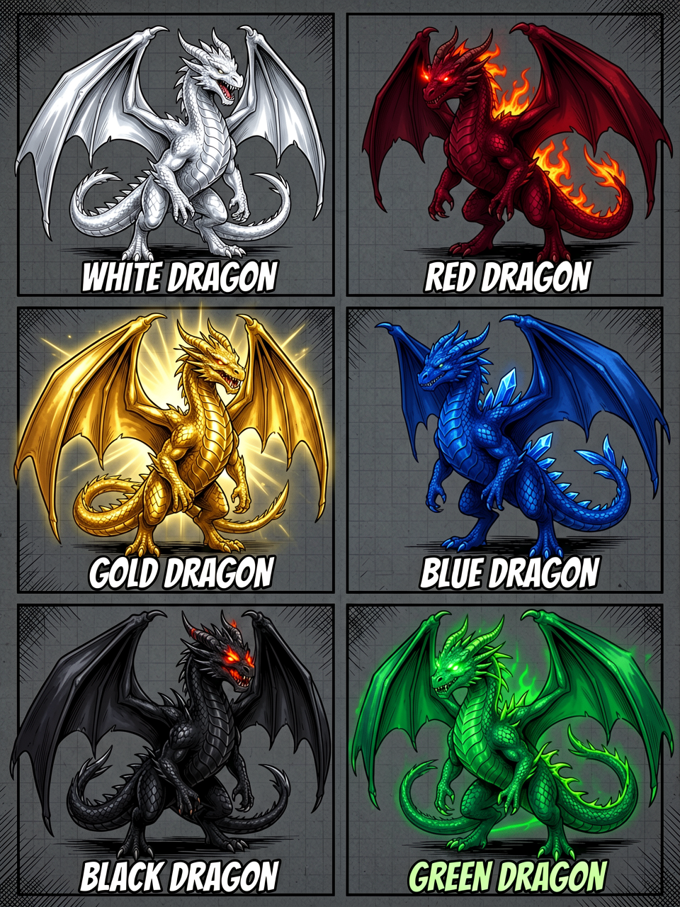
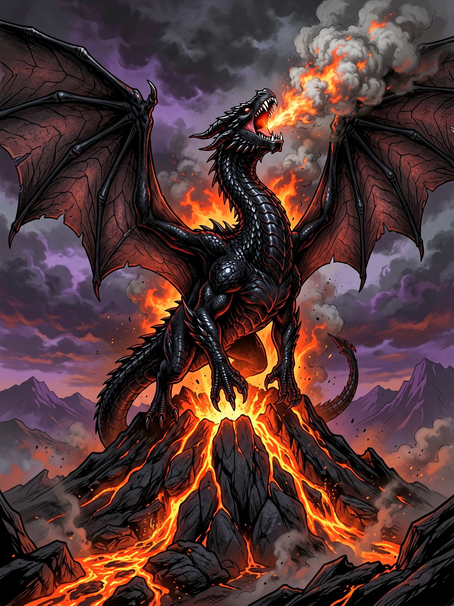

# 드래곤

타입: 종족
상태: 완료
생성 일시: 2026년 4월 26일 오전 9:30
최종 편집 일시: 2026년 4월 28일 오후 4:12

# 개요

룩스테라의 드래곤은 위그드라실에게서 태어난 토착의 생명으로, 단순한 맹수나 지능 있는 생물이라는 분류만으로는 설명하기 어렵다. 이들은 정령처럼 영적 기반을 지녔으면서도 분명한 육체와 생태를 가진 존재로서, 사람들은 드래곤을 ‘영물’로 부른다. 위그드라실의 축복을 강하게 받고 태어났기에 수명이 매우 길고, 마법적 기질 또한 본능에 가깝게 발현된다.

드래곤의 마법은 배움의 결과라기보다, 위그드라실로부터 이어진 ‘근원’이 스스로 세계와 호응하는 방식에 가깝다. 어떤 개체는 바람과 구름의 층위를 접어 길을 바꾸고, 어떤 개체는 마나의 밀도를 바꾸어 번개나 서리를 형상화한다. 그 힘은 대체로 공격성보다는 ‘환경을 조율’하는 성격을 띠며, 드래곤이 머무는 하늘의 대륙들이 오래도록 균형을 잃지 않는 이유 또한 이들의 존재와 연관이 있다고 여겨진다.

앙그라에서 드래곤이 발견되는 경우가 있으며, 이들은 모험가를 공격해 위협으로 기록되기도 한다. 그러나 앙그라가 걷힌 뒤에는 이지가 돌아온 듯 행동이 누그러지는 사례가 보고되었고, 이런 점 때문에 일부에서는 드래곤이 앙그라가 없던 시절에 지상에도 살았을 수 있다는 추측을 내놓는다.

# 기원과 분화

세월이 흐르며 드래곤과 유사한 종들이 생겨나기 시작했다. 그러나 ‘영물’로서의 위상을 인정받는 것은 원본인 드래곤들에 한정된다. 드래곤의 피나 형상을 닮은 유사종들은 위그드라실의 가호가 약해, 대개는 평범한 짐승이나 맹수로 분류된다.

이 분화는 드래곤이 ‘완성된 종’이어서가 아니라, 그 영적 핵이 위그드라실과 직접 이어져 있기 때문이라고 설명된다. 다시 말해, 유사종은 드래곤을 모방해 태어난 것이 아니라, 드래곤이 남긴 생태적 흔적과 마나의 잔향을 따라 자연이 빚어낸 파생물에 가깝다. 그래서 어떤 지역에서는 드래곤이 사라진 뒤에야 시간이 지나 ‘드래곤을 닮은 짐승’이 늘어났다는 기록도 남아 있다.

# 서식지: 드높은 하늘의 대륙

드래곤은 룩스테라의 지상이 아닌, 드높은 하늘의 대륙들에서 기거한다. 그곳은 구름층 위의 대지로 묘사되며, 먼 하늘에서 섬처럼 떠 있는 그림자나, 번개가 갈라질 때 잠깐 드러나는 산줄기로 관측되었다는 기록이 있다.

지상에 내려오는 일은 극히 드물다. 내려온다 하더라도 그것이 사냥이나 약탈 때문이라고 단정하기 어렵고, 대개는 ‘균형의 징후’로 받아들여진다. 하늘의 대륙에 변동이 생겼거나, 지상의 마나 흐름이 비정상적으로 뒤틀렸거나, 혹은 앙그라의 안개가 지상과 대기권의 경계에서 비정상적인 교란을 일으켜 하늘길이 흔들렸을 가능성이 거론된다. 때문에 드래곤의 출현은 두려움과 경외를 동시에 불러일으키며, 어떤 도시에서는 드래곤 목격 자체가 수십 년에 한 번 있을까 말까 한 사건으로 기록된다.

# 기록된 일화: ‘안개의 날개’

북부 해안의 오래된 항해일지에는, 폭풍이 걷히지 않던 밤에 “안개 속에서 거대한 날개가 파도 위를 스쳤고, 번개가 갈라질 때 그 비늘이 별처럼 반짝였다”는 문장이 남아 있다. 선원들은 그것을 재앙의 징조로 여겨 돛을 내렸으나, 그 순간 바람의 방향이 바뀌며 배가 암초대를 비껴 갔다고 적었다.

며칠 뒤 인근 만(灣)에서 앙그라의 못이 발견되었고, 정제사들이 봉쇄에 성공한 후 폭풍 또한 거짓말처럼 잦아들었다고 한다. 일지의 필자는 마지막에 이렇게 남겼다. “그 날개의 주인은 우리를 살린 것인지, 혹은 단지 안개의 사냥감을 놓친 것인지 알 수 없다. 다만, 안개가 걷힌 하늘은 이전보다 더 깊어 보였다.”

# 항목

내용