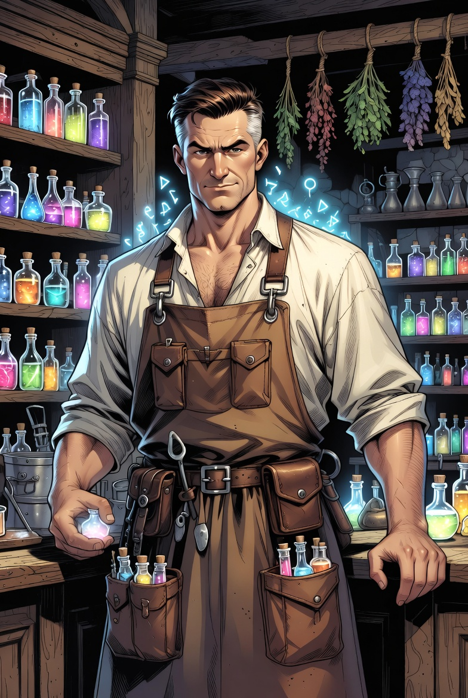

# 테오르 마르케인

타입: 인물
서브타입: 주요
상태: 완료
생성 일시: 2026년 4월 27일 오후 7:52
최종 편집 일시: 2026년 4월 27일 오후 7:58

# 개요

테오르 마르케인은 [자유 탐사 도시 오리진](%EC%9E%90%EC%9C%A0%20%ED%83%90%EC%82%AC%20%EB%8F%84%EC%8B%9C%20%EC%98%A4%EB%A6%AC%EC%A7%84%207c9bdde03880452792fb48ccad965440.md)의 생활·잡화·물약 상점을 실질적으로 굴리는 상인으로, 전초기지의 일상을 ‘굶지 않고, 쓰러지지 않고, 다시 출발할 수 있게’ 붙들어 매는 사람이다. 본래는 모험가로서 던전과 안개권을 드나들었으나, 반복되는 손실과 우연한 생환을 거치며 “검 하나보다 중요한 것이 있다”는 결론에 닿았다. 테오르가 상점의 문을 지키기 시작한 뒤부터 오리진의 거래는 화려해지지 않았지만, 대신 필요한 물건이 끊기는 일이 줄어들었다.

테오르는 물품을 ‘팔기 좋은 것’이 아니라 ‘없으면 죽는 것’으로 분류한다. 천과 바늘, 등불 심지와 기름, 야전 잉크와 간이 방수 포, 손을 덜 떨리게 만드는 진정제, 급히 피를 멎게 하는 지혈약 같은 것들이 늘 같은 자리에서 발견되는 이유다. 물약 상점의 약제는 검은 등불 회관의 접수 기록과 구조대의 소요를 기준으로 우선순위가 잡히며, 테오르는 공급이 흔들리면 먼저 “다음 주에 죽을 사람”부터 계산한다. 이때 테오르는 [크리스틴 밀러](%ED%81%AC%EB%A6%AC%EC%8A%A4%ED%8B%B4%20%EB%B0%80%EB%9F%AC%2034e3ce531dea809bbdffd6a987ea523f.md)가 정리하는 접수 문서의 흐름을 참고하고, 최종적으로는 [듀란 애시모르](%EB%93%80%EB%9E%80%20%EC%95%A0%EC%8B%9C%EB%AA%A8%EB%A5%B4%2034e3ce531dea80d782c9fe1fd855182a.md)와 [카밀론 락클리프 ](%EC%B9%B4%EB%B0%80%EB%A1%A0%20%EB%9D%BD%ED%81%B4%EB%A6%AC%ED%94%84%2034e3ce531dea803fbb4ada4c35eb0fde.md)의 운영 판단에 맞춰 보급 우선순위를 조정한다. 그 계산은 차갑지만, 목적은 명확하다. 더 많은 사람이 ‘돌아오게’ 하는 것.

오리진의 규약이 도시를 지탱한다면, 테오르의 상점은 규약을 현실로 만드는 접점이다. 모험가들은 출발 직전에 이곳에서 마지막으로 장비를 점검하고, 낡은 끈을 새로 바꾸고, 해독제 하나를 더 챙길지 말지를 두고 망설인다. 테오르는 그 망설임을 가벼이 넘기지 않는다. “무게는 짐이지만, 빈손은 무덤”이라는 말을 농담처럼 던지며, 결국에는 각자가 감당할 수 있는 생존의 선을 스스로 선택하게 만든다. 그래서 테오르 마르케인은 상인이면서도, 오리진에서만큼은 출발선을 지키는 또 하나의 교관으로 취급된다.

# 항목

내용