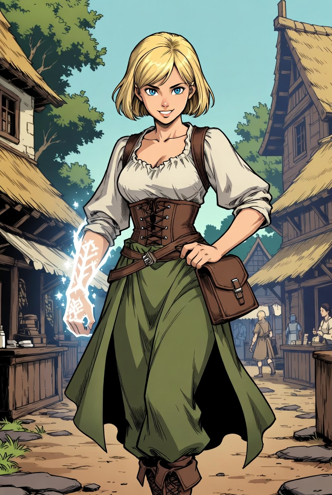

# 에리나 밀러

타입: 인물
서브타입: 주요
상태: 완료
생성 일시: 2026년 4월 27일 오전 3:23
최종 편집 일시: 2026년 4월 27일 오전 3:44

# 개요

에리나는 그레이브록 마을에서 조용히 살아가던 20대 여성으로, 겉으로는 평범했으나 [정제사](%EC%A0%95%EC%A0%9C%EC%82%AC%203323ce531dea80049dece6756b2c3a04.md)로서의 재능을 타고났다. 다만 마을 안에서는 그 재능을 드러내기보다, 생활을 꾸리고 사람들 틈에 섞여 지내는 쪽을 선택해 오랫동안 ‘아는 사람만 아는’ 존재로 남아 있었다.

그런 에리나가 [자유 탐사 도시 오리진](%EC%9E%90%EC%9C%A0%20%ED%83%90%EC%82%AC%20%EB%8F%84%EC%8B%9C%20%EC%98%A4%EB%A6%AC%EC%A7%84%207c9bdde03880452792fb48ccad965440.md)으로 향하게 된 것은, 작은 마을의 삶으로는 감당할 수 없는 사건이 계기가 되었기 때문이다. 에리나와 [크리스틴 밀러](%ED%81%AC%EB%A6%AC%EC%8A%A4%ED%8B%B4%20%EB%B0%80%EB%9F%AC%2034e3ce531dea809bbdffd6a987ea523f.md)의 부모가 [앙그라의 안개](%EC%95%99%EA%B7%B8%EB%9D%BC%EC%9D%98%20%EC%95%88%EA%B0%9C%203323ce531dea8042a1abe1f971d4e8f3.md) 속 원정에서 목숨을 잃은 뒤, 에리나는 남은 가족과 함께 그레이브록으로 흘러들어와 상처를 추슬렀다. 그곳에서 귀인(주인공 세력)들과 마주친 것이 전환점이 되었고, 에리나와 [아카이럼 밀러](%EC%95%84%EC%B9%B4%EC%9D%B4%EB%9F%BC%20%EB%B0%80%EB%9F%AC%2034e3ce531dea80c39082d916902f490a.md)는 그 인연을 따라 오리진으로 향하게 된다.

그래서 가족의 선택은 더는 ‘조용히 사는 것’으로 남아 있을 수 없게 되었다. 오리진에서 그녀의 재능은 숨길 수 없는 속도로 드러났고, 부정한 핵과 흑마석의 정제, 시료의 분류, 응급 정화 같은 실무에서 눈에 띄는 성과를 남기며 빠르게 이름을 알리기 시작했다. 결국 에리나는 ‘조용한 재능’에서 ‘현장을 살리는 정제사’로 변해 가며, 오리진이 요구하는 위험과 기록의 속도에 맞춰 자신만의 자리와 명성을 만들어 낸 인물로 여겨진다.

# 항목

내용
