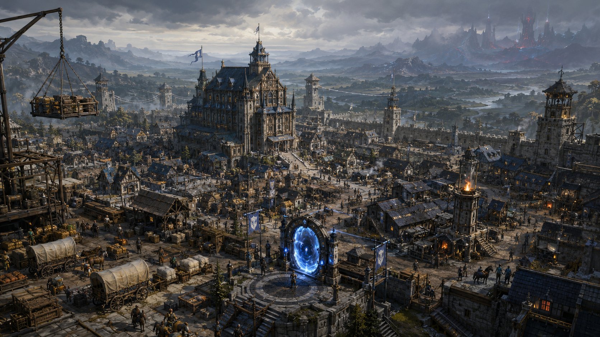

# 자유 탐사 도시 오리진

타입: 도시국가
영역: 에리디안
상태: 완료
생성 일시: 2026년 4월 26일 오전 4:33
최종 편집 일시: 2026년 6월 1일 오전 12:43

<aside>

이 문서는 **국가 설정 템플릿**을 적용해, 오리진을 “도시국가(연맹령)”로 정리한 문서입니다. 오리진의 공고와 임무 공지는 [자유 탐사 연맹 공고 유형](%EC%9E%90%EC%9C%A0%20%ED%83%90%EC%82%AC%20%EC%97%B0%EB%A7%B9%20%EA%B3%B5%EA%B3%A0%20%EC%9C%A0%ED%98%95%203703ce531dea80ea8594d3a1433da779.md)을 **명확히 따르는 것**을 전제로 합니다.

</aside>

## 개요

**자유 탐사 도시 오리진**은 [자유 탐사 연맹](%EC%9E%90%EC%9C%A0%20%ED%83%90%EC%82%AC%20%EC%97%B0%EB%A7%B9%203323ce531dea807c8649ce973b2e1d27.md)이 에리디안 대륙 동부에 건설한 **중립 개척 도시형 전진 거점**이자 연맹령이다. 오리진은 특정 국가의 영토에 편입되지 않으며 연맹 규약 아래 운영된다. 이곳의 ‘의뢰’는 용병 계약이 아니라, 위험과 단서를 정리해 공개하는 **연맹 공고**의 형태로 유통되며, 사건은 “누가 부탁했는가”가 아니라 “무엇을 알아내고 어떤 위험을 규명해야 하는가”를 기준으로 분류·게시된다.[[1]](%EC%9E%90%EC%9C%A0%20%ED%83%90%EC%82%AC%20%EC%97%B0%EB%A7%B9%20%EA%B3%B5%EA%B3%A0%20%EC%9C%A0%ED%98%95%203703ce531dea80ea8594d3a1433da779.md)

오리진은 **AAC 0년(원년)** 이후 약 **2년에 걸쳐** 설립되었고, **AAC 7년** 무렵부터 소도시의 외형과 기능을 갖추기 시작했다. 현재 시점은 **AAC 0078년(재앙후력 78년)**이다. 대재앙 이후 장기전이 일상이 된 시대에, 오리진은 동부 개척권의 물류·정보·구조·기록을 집약하여 “다시 들어가기 위한 준비”를 가능하게 만드는 거점으로 기능한다. 오리진의 성립은 동부 변방의 던전 각성과 직결되며, 연맹은 공략의 지속과 생존의 재투입을 위해 거점을 고정했고 오리진은 그 장기전을 위한 전진 도시로 자리 잡았다.

## 지리·환경

오리진은 에리디안 대륙 동부의 관문 지대에 자리해, 에리디안 제국 남동과 연맹의 동부 활동권 사이를 잇는 완충점이 된다. 이곳의 지리적 의미는 방어선의 “끝”이 아니라, 동부 변방에서 발생하는 현상과 자원을 **회수하여 기록으로 환원**할 수 있는 거리라는 데 있다. 도시 외곽은 위험권과 완충권이 단계적으로 배치되어 있으며, 내부의 생활권은 편의보다 재투입을 우선하는 방식으로 설계되었다.

동부 환경의 핵심 변수는 던전과 잔향이 만들어내는 **불안정한 마나 질서**다. 오리진은 완전한 안전을 제공하는 도시가 아니라, 위험을 절차로 분해하고 기록으로 축적해 “관리 가능한 수준”으로 낮추는 도시다. 때문에 오리진의 방어 시설과 치안선은 화려함보다 실무적 안정성을 중시하며, 사람들은 일상 속에서 규약과 기록을 생존 장치로 받아들이게 된다.

## 역사(현재를 만든 사건들)

오리진의 역사는 성취의 연대기라기보다, 동부 위험이 ‘일시적 사건’이 아니라 ‘지속되는 전선’이 되면서 누적된 필요의 결과다. 던전 각성은 주변 마나 질서를 흔들고 방어 장치를 활성화시켜, 단발성 공략이나 봉쇄로는 문제를 끝낼 수 없게 만들었다. 연맹은 모험가의 생존과 재투입을 전제로 공략을 지속하기 위해, 구조·회수·기록·재분류를 반복할 수 있는 고정 거점을 필요로 했고 그 답이 오리진이었다.

초기의 오리진은 전진 야영지와 등록소에 가까웠으나, 장기전이 굳어지면서 “돌아오는 도시”가 아니라 “다시 들어가는 도시”가 되었다. 의뢰는 용병 계약의 형태를 벗어나 탐사 과제로 정리되었고, 회수는 개인의 이권을 위한 심부름이 아니라 시료와 관측 자료를 확보해 위험도를 재분류하는 도시 운영의 핵심 절차로 자리 잡았다. 이 전환이 오리진을 단순한 전진기지에서 동부 개척권의 장기전 인프라로 바꾸었다.

## 통치 구조·법·행정

오리진의 최종 권위는 [자유 탐사 연맹](%EC%9E%90%EC%9C%A0%20%ED%83%90%EC%82%AC%20%EC%97%B0%EB%A7%B9%203323ce531dea807c8649ce973b2e1d27.md)에 있으며, 도시는 연맹 규약에 의해 유지되는 중립 도시로 운영된다. 총책임자는 [듀란 애시모르](%EB%93%80%EB%9E%80%20%EC%95%A0%EC%8B%9C%EB%AA%A8%EB%A5%B4%2034e3ce531dea80d782c9fe1fd855182a.md)이며, 부책임자 겸 부관은 [카밀론 락클리프 ](%EC%B9%B4%EB%B0%80%EB%A1%A0%20%EB%9D%BD%ED%81%B4%EB%A6%AC%ED%94%84%2034e3ce531dea803fbb4ada4c35eb0fde.md)이다. 오리진은 유입 인구와 이해관계가 복잡해도 규약이 등록·분쟁 조정·공고 표준·금지 행위의 경계를 고정함으로써 붕괴를 막는다.

행정은 기능별 조직으로 분화되어 돌아간다. 회관을 중심으로 등록과 기록, 공고의 문서화, 회수 시료와 관측 자료의 인계 절차가 도시의 숨줄을 이룬다. 던전 탐사부는 공략 기록·지도·관측을 관리하고 위험도 분류 기준을 유지하며, 모험가(탐사자) 교육부는 규약·절차·생존 원칙 교육과 초반 파티 편성·공고 중개를 맡는다. 규약 집행이 필요한 상황에서는 모험가보다 [에리디안 경비대](%EC%97%90%EB%A6%AC%EB%94%94%EC%95%88%20%EA%B2%BD%EB%B9%84%EB%8C%80%204fe381f330314b58b31787e3aee329db.md) 같은 상설 치안 조직이 전면에 선다.

## 군사·치안·외교

오리진의 중립은 “무장하지 않은 중립”이 아니라, 규약과 치안이 결합된 현실적 중립이다. 도시 수비와 치안은 [에리디안 경비대](%EC%97%90%EB%A6%AC%EB%94%94%EC%95%88%20%EA%B2%BD%EB%B9%84%EB%8C%80%204fe381f330314b58b31787e3aee329db.md)를 중심으로 운영되며, 오리진의 치안은 범죄를 소거하기보다 장기전 거점에서 치명적인 혼란을 막는 데 초점이 맞춰져 있다. 밀수와 금지품, 허위 공고, 기록 조작은 단순 범죄가 아니라 도시의 재투입 체계를 무너뜨리는 위협으로 취급된다.

대외적으로 오리진은 어느 국가의 편에도 서지 않지만, 주변 세력에게 오리진은 동부 전선의 관문이자 기록과 물류가 모이는 결절점으로 인식된다. 따라서 오리진은 군사적 충돌을 최소화하는 대신, 규약과 기록의 표준을 유지해 “누구도 도시를 통째로 점유할 수 없게” 만드는 방식으로 중립을 방어한다.

## 경제·산업·물류

오리진의 경제는 풍요가 아니라 **지속**을 목표로 한다. 도시의 상업은 탐사자의 재투입에 필요한 보급과 정비, 회수 물자의 처리, 정보의 교환을 중심으로 돌아간다. 생활·잡화·물약 상점은 [테오르 마르케인](%ED%85%8C%EC%98%A4%EB%A5%B4%20%EB%A7%88%EB%A5%B4%EC%BC%80%EC%9D%B8%2034f3ce531dea8044b26ec6031dd7007e.md)이 운영하며, 품목은 야전 생존과 재투입에 맞춰 관리된다. 물약류와 해독제, 소독제 등의 재고는 회관의 접수 기록과 구조대 소요를 기준으로 조정된다.

장비 측면에서는 제작보다 수선과 표준화가 핵심이다. 붉은 모루 대장간은 던전·안개권에서 돌아온 장비를 파손 원인에 따라 정비하고, 수선 내역을 기록으로 남긴다. 바람 상회는 [위스크 바람](%EC%9C%84%EC%8A%A4%ED%81%AC%20%EB%B0%94%EB%9E%8C%2034e3ce531dea80a28a67c78eaaffadd3.md)이 이끄는 대표 교환소로, 장비·소모품·정제 재료를 취급하며 위험 거래를 별도 기록해 규약 위반 가능성을 관리한다. 오리진의 물류는 시장 논리만으로 굴러가지 않고, 기록과 치안이 물건의 흐름을 함께 규정한다.

## 사회·문화

오리진의 시민성과 탐사자 문화는 “편안한 생활”이 아니라 “안전한 재투입”을 중심으로 조직된다. 도시의 시설은 거래·휴식·수선을 한데 묶기보다 등록/기록/치안/보급/정비/정보 기능이 분리되어, 사고와 분쟁을 구조적으로 줄이는 방향으로 운영된다. 이 때문에 오리진의 분위기는 거칠고 실무적이며, 사람들은 친절보다 절차 준수를 예의로 받아들인다.

부러진 곡괭이는 은퇴한 전설급 모험가 [아그네스 밀러](%EC%95%84%EA%B7%B8%EB%84%A4%EC%8A%A4%20%EB%B0%80%EB%9F%AC%2034e3ce531dea80eba3cac59836958cf8.md)가 운영하는 휴식과 정보 교환의 장소다. 회관이 공식 기록을 다루는 곳이라면, 이곳은 현장의 소문·위험 징후·금기 변화 같은 비공식 정보가 빠르게 모이는 곳이다. 다만 도시 규약을 위협하는 밀수·금지품 소문이 확산되는 경우, 경비대가 개입할 수 있도록 정보가 흘러들어가며 오리진은 그 경계를 늘 시험받는다.

## 종교·신앙·초상

오리진은 특정 국교를 전면에 내세우지 않는다. 연맹령의 중립을 유지해야 하고, 탐사자 집단의 구성 또한 다양하기 때문이다. 그러나 신앙이 부재한 것은 아니다. 오리진에서 신앙은 권력의 깃발이 아니라 생존의 언어로 나타난다. 출정 전의 짧은 의례, 구조와 귀환을 위한 개인적 신념, 금기를 건드리지 않기 위한 경계가 생활 속에 남아 있으며, 이는 각자의 방식으로 위험 앞에서 정신을 붙들기 위한 습관이 된다.

초상 현상 또한 오리진에서는 현실적으로 다뤄진다. 위험권에서 회수되는 유물과 시료, 관측 자료는 종교적 해석의 대상이 될 수 있으나, 우선은 위험 재분류의 근거로 취급된다. 오리진의 “신성함”은 성지의 권위가 아니라, 축적된 기록이 가진 무게로 드러난다.

## 주요 지역(수도/핵심 거점)

오리진의 핵심 거점은 도시의 체계를 지탱하는 기능 단위로 형성된다. 검은 등불 회관은 연맹 등록, 공고 중개, 분쟁 조정, 지도·기록 보관의 중심 시설이며 탐사자는 이곳에서 등록을 갱신하고 파티 단위로 출입·귀환 기록을 남긴다. 실무는 [크리스틴 밀러](%ED%81%AC%EB%A6%AC%EC%8A%A4%ED%8B%B4%20%EB%B0%80%EB%9F%AC%2034e3ce531dea809bbdffd6a987ea523f.md)가 접수·기록을 중심으로 맡고, [듀란 애시모르](%EB%93%80%EB%9E%80%20%EC%95%A0%EC%8B%9C%EB%AA%A8%EB%A5%B4%2034e3ce531dea80d782c9fe1fd855182a.md)와 [카밀론 락클리프 ](%EC%B9%B4%EB%B0%80%EB%A1%A0%20%EB%9D%BD%ED%81%B4%EB%A6%AC%ED%94%84%2034e3ce531dea803fbb4ada4c35eb0fde.md)도 이곳에서 주로 업무를 본다.

생활·잡화·물약 상점은 보급의 끊김을 막는 축이며, 붉은 모루 대장간은 장비를 표준으로 되돌리는 정비의 축이다. 바람 상회는 물품 교환과 위험 거래 관리가 맞물리는 접점으로 기능한다. 부러진 곡괭이는 탐사자들이 파티를 꾸리고 비공식 정보를 교환하는 공간이지만, 그 비공식 정보조차도 도시의 생존과 직접 연결되기에 오리진의 일상은 늘 규약과 치안의 그림자 아래 놓인다.

## 핵심 세력

오리진의 세력은 전통적인 귀족가나 왕실이 아니라, 도시 기능을 담당하는 조직과 인물 중심으로 구성된다. 연맹 규약과 행정의 중심에는 [듀란 애시모르](%EB%93%80%EB%9E%80%20%EC%95%A0%EC%8B%9C%EB%AA%A8%EB%A5%B4%2034e3ce531dea80d782c9fe1fd855182a.md)와 [카밀론 락클리프 ](%EC%B9%B4%EB%B0%80%EB%A1%A0%20%EB%9D%BD%ED%81%B4%EB%A6%AC%ED%94%84%2034e3ce531dea803fbb4ada4c35eb0fde.md)가 있으며, 기록과 접수의 실무는 [크리스틴 밀러](%ED%81%AC%EB%A6%AC%EC%8A%A4%ED%8B%B4%20%EB%B0%80%EB%9F%AC%2034e3ce531dea809bbdffd6a987ea523f.md)의 손에서 도시의 신뢰를 유지한다. 치안과 규약 집행의 상징은 [에리디안 경비대](%EC%97%90%EB%A6%AC%EB%94%94%EC%95%88%20%EA%B2%BD%EB%B9%84%EB%8C%80%204fe381f330314b58b31787e3aee329db.md)이며, 경제와 보급의 측면에서는 [테오르 마르케인](%ED%85%8C%EC%98%A4%EB%A5%B4%20%EB%A7%88%EB%A5%B4%EC%BC%80%EC%9D%B8%2034f3ce531dea8044b26ec6031dd7007e.md)의 상점과 [위스크 바람](%EC%9C%84%EC%8A%A4%ED%81%AC%20%EB%B0%94%EB%9E%8C%2034e3ce531dea80a28a67c78eaaffadd3.md)의 바람 상회가 도시의 생존을 받친다. [아그네스 밀러](%EC%95%84%EA%B7%B8%EB%84%A4%EC%8A%A4%20%EB%B0%80%EB%9F%AC%2034e3ce531dea80eba3cac59836958cf8.md)의 부러진 곡괭이는 탐사자 문화와 현장 감각을 보존하는 비공식 허브로 작동한다.

## 관계

### 내부 권력 구도(세력 간 관계)

오리진의 내부 권력은 한 사람의 통치가 아니라, 규약과 기록의 축 위에서 배분된다. 회관이 표준과 절차를 만들고, 경비대가 그 절차를 강제하며, 상회와 상점이 절차가 지속되도록 물자를 공급한다. 부러진 곡괭이는 비공식 정보를 모으지만, 소문이 규약을 위협하는 순간 치안의 개입을 부른다는 점에서 완전한 자유지대가 되지 못한다. 오리진에서 가장 불안정한 연결은 비공식 정보와 공식 기록 사이의 간극이며, 누군가가 그 틈을 악용하려 할 때 도시 전체가 흔들린다.

### 외교 관계(주변 국가/연맹/교단)

오리진은 연맹령으로서 중립을 표방하지만, 주변 국가와 세력에게 오리진은 동부 전선의 관문이자 정보와 물류가 모이는 거점이다. 연맹은 오리진을 통해 인력과 시료, 공고와 기록을 통제 가능한 형태로 유지하려 하고, 주변 세력은 그 통제 방식에 개입하려 한다. 그 결과 오리진의 중립은 단순한 선언이 아니라, 규약과 절차를 유지하기 위한 지속적인 조정의 산물로 남는다.

### 관계 훅(갈등·사건으로 이어지는 촉발점)

오리진에서 가장 쉽게 불이 붙는 지점은 공고와 회수의 정의가 흔들리는 순간이다. 누군가가 공고를 용병 계약처럼 왜곡하거나, 회수를 개인적 심부름과 이권 다툼으로 바꾸려 할 때 규약은 강하게 반발한다. 또한 기록 보관실의 자료가 조작되거나 누락되는 사건은 도시 전체의 위험 분류를 무너뜨리며, 그 파장은 경비대의 강경 집행과 탐사자 사회의 반발로 이어질 수 있다.

## 현재의 갈등·사건 훅

오리진의 갈등은 장기전의 피로가 누적되는 가운데, 절차가 도시를 살리면서도 동시에 도시를 조이는 모순에서 발생한다. 단기적으로는 허위 공고와 과장된 소문, 금지품 유통 같은 사건이 치안을 흔들고, 경비대의 개입이 탐사자들의 반발을 부를 수 있다. 중기적으로는 연맹 내부에서 오리진의 운영 비용과 성과를 둘러싼 논쟁이 커지며, 규약의 강화 혹은 완화가 정치적 갈등으로 번질 여지가 있다. 장기적으로는 동부 위험권의 변화가 오리진의 분류 체계 자체를 시험한다. 위험이 “분류 가능한 형태”를 벗어나기 시작하는 순간, 오리진은 도시로서가 아니라 시스템으로서 생존을 요구받게 된다.

## 요약

- **분류**: 연맹령 중립 전진 도시국가
- **중심 이념**: 중립의 유지와 장기전의 지속(규약·기록·절차)
- **주요 기반**: 탐사자 재투입 체계, 공고 표준화, 회수·구조·기록의 축적
- **주요 관계**: 자유 탐사 연맹 중심, 주변 세력의 관문/개입 압력
- **핵심 갈등**: 비공식 정보와 공식 기록의 간극, 규약 강화에 대한 반발, 위험권의 예측 불가능한 변화
