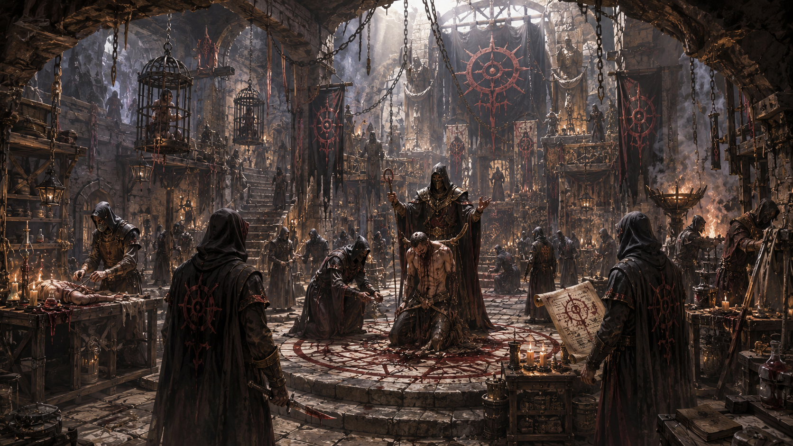

# 컬트 오브 디스페어

타입: 단체
서브타입: 주요
영역: 범대륙
상태: 완료
생성 일시: 2026년 4월 23일 오전 3:49
최종 편집 일시: 2026년 6월 16일 오후 9:49

## 개요

**컬트 오브 디스페어**는 악신격인 [고통과 절망의 신 페레고르](https://app.notion.com/p/34a3ce531dea80b8a60df79ec279a08e?pvs=21) 신앙과 연결된 범세계적 빌런 집단이자, 산 자를 페레고르의 성소에 바치는 일을 수행하는 살수 집단이다. 이들에게 살해는 계약의 결과가 아니라 의식의 시작이며, “죽이기”보다 “살아 있는 채로 절망의 끝까지 몰아넣기”가 목적에 가깝다. 그래서 컬트의 위협은 칼날보다도 오래 지속되는 공포와 고립, 그리고 희망을 잘라내는 설계에서 비롯된다.

이 단체는 하나의 공개 본부로 존재하지 않는다. 여러 대륙과 도시, 전쟁지대와 빈민가, 귀족 사회의 그림자 속에 은밀히 뿌리내리며, 지역마다 다른 얼굴로 나타난다. 어떤 곳에서는 연쇄 납치 집단처럼 보이고, 어떤 곳에서는 귀족 암투에 고용되는 살수 조직으로 보이며, 또 다른 곳에서는 종말론적 컬트로 보인다. 그러나 어디에서든 결말은 같다. 산 자를 “절망이 완성된 제물”로 만들고, 그 붕괴의 순간을 페레고르에게 바친다.

## 기원과 설립

컬트 오브 디스페어는 페레고르 신앙의 가장 폭력적이고 조직적인 실천이 응결된 형태로 알려져 있다. 고통과 절망을 신성시하는 금기 신앙은 오래전부터 문명권의 틈에서 변종처럼 번졌지만, 컬트는 그 신앙을 “행동 조직”으로 완성시켰다. 신앙이 개인의 금기와 의식으로 머물 때는 추적이 가능하지만, 그것이 살수·납치·감금의 기술과 결합하는 순간, 절망은 하나의 산업이 된다.

컬트는 특정한 창립자나 단일한 창교 사건으로 설명되기 어렵다. 여러 지역의 절망 신도 집단이 서로를 모방하고, 사제와 살수가 교환되며, ‘성소로의 봉헌’이라는 방법론이 전파되는 과정에서 자연스럽게 공통의 이름 아래 묶였다. 그래서 컬트의 설립사는 연대기보다도 “어떤 절망이 어떻게 조직으로 굳어졌는가”로 기록되는 경우가 많다.

## 목적과 활동 방식

컬트가 산 자를 바치는 이유는 페레고르에게 가장 진한 제물이 죽음 그 자체가 아니라, 죽음에 이르기 직전의 **고통과 절망**이라고 믿기 때문이다. 이미 죽은 시체는 더 이상 무너질 수 없고 비명을 지르지 않는다. 컬트는 “희망이 끝까지 살아 있다가, 마지막 순간에 꺼지는 장면”이야말로 성소가 열리는 순간이라 확신한다.

따라서 이들의 작전은 암살이 아니라 붕괴의 설계다. 목표를 추적하고, 고립시키고, 주변의 도움을 끊고, 희망을 하나씩 제거한 뒤 성소로 끌고 간다. 때로는 가족과 동료를 먼저 무너뜨리고, 때로는 구출이 가능하다는 거짓 신호를 남겨 절망을 더 깊게 만든다. 컬트의 살수는 칼날보다 인내를 중시하며, “도망칠 수 있을 것처럼 길을 열어 준 뒤, 그 모든 가능성이 거짓이었음을 드러내는” 방식이 그들의 의식적 수법으로 전해진다.

## 조직 구조

컬트 오브 디스페어는 중앙 성전이나 공개된 수장을 중심으로 움직이지 않는다. 조직은 여러 지역에 흩어진 세포로 활동하며, 각 세포는 서로의 전체 규모를 알지 못한 채 독립적으로 임무를 수행한다. 이 구조 덕분에 한 지부가 무너져도 전체 조직은 쉽게 사라지지 않으며, “컬트는 언제든 다른 도시에서 다시 나타난다”는 악명을 얻게 되었다.

세포 내부에는 목표를 추적하는 살수, 정보를 모으는 밀정, 의식을 준비하는 사제, 고문과 감금을 담당하는 집행자, 시체와 흔적을 처리하는 장의사, 치료의 이름으로 대상을 오래 살려 두는 타락한 의사들이 존재한다. 역할은 달라도 최종 목적은 같다. 산 자를 절망의 끝까지 몰아넣어, 페레고르의 성소에 바치는 것. 이들은 서로를 ‘동료’라기보다 ‘의식의 도구’로 대하는 경향이 강하며, 실패는 곧 신에게 바칠 제물의 훼손으로 간주된다.

## 규모와 거점

컬트는 단일한 본거지를 두지 않으며, 성소는 고정된 지리라기보다 “의식이 완성되는 장소”로 취급된다. 어떤 경우에는 지하 묘지나 폐허가 된 성당이 성소가 되고, 어떤 경우에는 전쟁터의 야전 천막이 성소가 되며, 어떤 경우에는 귀족 저택의 지하가 성소가 된다. 그래서 컬트의 거점은 지도 위의 점이 아니라, 도시의 어둠 속에 숨어 있는 구조로 이해된다.

세포는 소규모로 유지되지만, 위기와 전란이 겹치는 시기에는 급격히 늘어난다. 난민촌, 패전한 병사, 몰락한 귀족, 파산한 상단처럼 “한 번 무너진 사람들”이 컬트의 포섭 대상이 되기 쉽기 때문이다. 따라서 컬트의 규모는 고정된 인원 수로 파악되기보다, 절망이 축적되는 속도에 따라 파도처럼 증감한다.

## 자원과 상징

컬트의 자원은 금전보다도 **절망을 만드는 기술**이다. 납치·감금·고문·세뇌·심리 조작, 그리고 흔적을 지우는 장의 기술은 이 조직의 핵심 자산이다. 또한 귀족 사회와 범죄 조직, 전쟁지대의 혼란 속에 심어 둔 정보망이 강력한 무기가 된다. 컬트는 직접 싸움으로 강한 조직이기보다, 싸움이 일어나기 전에 상대의 발판을 무너뜨리는 조직이다.

상징은 ‘절망의 성소’와 ‘가면’이다. 구성원은 얼굴을 숨기고 역할로만 존재하며, 의식이 완성되는 순간에는 대개 신에게 바치는 문장과 표식을 남긴다고 전해진다. 그 표식은 승리의 증거가 아니라 “희망은 거짓”이라는 선언이며, 피해자의 주변을 더 깊은 불신으로 물들인다.

## 대외 관계

컬트는 페레고르 신앙과 연결되어 있으나, 모든 페레고르 신도가 이 집단에 속하는 것은 아니다. 페레고르 교단이 금기 신앙의 스펙트럼이라면, 컬트 오브 디스페어는 그중에서도 “살수와 봉헌”을 수행하는 폭력 조직이다. 따라서 컬트는 같은 신앙권 내부에서도 두려움과 혐오의 대상이 되곤 한다.

세속 권력과의 관계는 거래에 가깝다. 컬트는 암투와 전쟁의 그림자를 먹고 자라며, 어떤 귀족이나 상단, 변방 군벌은 필요에 따라 이들을 고용한다. 그러나 컬트는 단순한 용병이 아니다. 대가로 요구하는 것이 돈만이 아니라, “제물”과 “절망이 완성될 조건”이기 때문에, 고용자는 결국 자신도 그 의식의 일부가 된다.

## 내부 갈등과 약점

세포 조직은 생존에 유리하지만, 동시에 통제가 어렵다. 어떤 세포는 절망을 ‘예술’로 여겨 지나치게 과시하고, 어떤 세포는 신앙보다 돈에 기울어 타락한다. 컬트 내부에서 이는 “제물의 질을 떨어뜨리는 배신”으로 간주되어 숙청과 암투로 이어지기도 한다.

또한 컬트의 의식은 시간이 필요하다. 목표를 오래 붙잡아 두고 절망을 설계해야 하므로, 빠른 대응과 정보 공유가 이루어지면 계획이 무너질 수 있다. 즉, 컬트를 무너뜨리는 방법은 ‘정면전’보다도, 납치와 고립이 성립하지 못하도록 도시의 치안과 공동체의 신뢰를 지키는 쪽에 가깝다.

## 현재 동향

최근 컬트는 전면적인 연쇄 살해보다, “사라지는 사람들”과 “되돌아온 사람들”의 소문으로 나타난다는 보고가 많다. 단순한 공포의 과시가 아니라, 공동체 내부의 불신을 극대화해 스스로 붕괴하도록 만드는 방식이다. 특히 전쟁과 재난이 겹치는 권역에서, 컬트는 구호와 구조의 얼굴을 흉내 내며 접근해 더 큰 절망을 설계한다.

또한 귀족 사회의 암투가 격해질수록 컬트는 ‘고용되는 살수’가 아니라, 고용주를 함께 무너뜨리는 재앙이 되곤 한다. 컬트의 의식은 한 명의 죽음으로 끝나지 않고, 주변의 희망과 신뢰를 함께 바치는 방향으로 확대되기 때문이다.

## 시나리오 활용

컬트 오브 디스페어는 플레이어에게 단순한 암살 의뢰보다, “납치된 누군가를 절망이 완성되기 전에 되찾는” 형태로 등장하기 좋다. 구출이 늦어질수록 제물은 단순한 피해자가 아니라, 도시를 무너뜨리는 상징이 된다. 또한 컬트는 적을 외부가 아니라 내부에서 찾게 만들기 때문에, 플레이어가 해결해야 하는 것은 전투력보다도 정보전과 신뢰 회복인 경우가 많다.

컬트의 성소를 찾는 과정은 던전 탐사보다도 도시의 어둠을 추적하는 여정이 된다. 한 번의 승리로 끝나기 어렵고, 승리 뒤에도 “다른 도시에서 다시 나타날 수 있다”는 불안을 남긴다. 그래서 이 단체는 캠페인에서 장기적인 공포의 축으로 활용하기 적합하다.

## 부가 항목

컬트에게 제물은 ‘죽음’이 아니라 ‘붕괴’다. 그래서 이 조직의 이야기는 항상 “마지막까지 붙잡고 있던 희망이 무엇이었는가”로 귀결된다. 컬트가 남기는 표식과 소문, 그리고 살아남은 자의 증언은 단체의 존재를 과시하는 동시에, 다음 의식을 위한 씨앗이 된다. 어떤 도시에서는 그 표식을 흉내 내는 모방 범죄가 생겨나기도 하며, 그 모방이 진짜 컬트를 불러들이는 악순환이 만들어지기도 한다.
