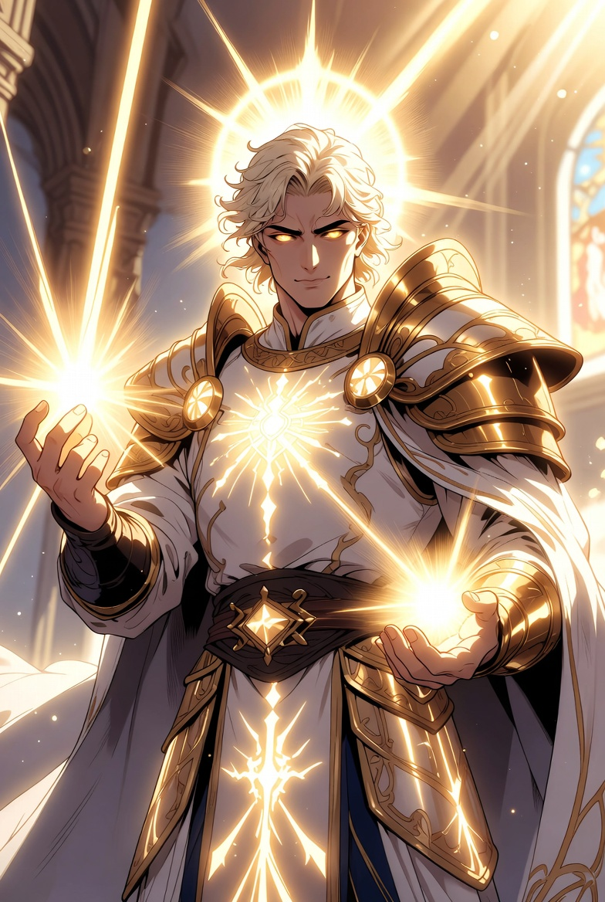

# 빛의 신 룬다르

상태: 완료
등급: 주신격
성향: 선신
도메인: 빛, 생명, 원소
포트폴리오: 빛의 원소, 생명의 빛, 성광, 순수광, 정화광, 치유, 치유광
생성 일시: 2026년 4월 19일 오전 7:57
최종 편집 일시: 2026년 6월 8일 오전 2:05
성향 정렬값: 1
등급 정렬값: 1
대표: Yes
청연 만신전: No

# 개요

빛의 신 룬다르는 [룩스테라](https://app.notion.com/p/3323ce531dea8016a84ae7818e90c6ef?pvs=21)에서 가장 넓은 영향력을 지닌 신격 가운데 하나다. 룩스테라라는 이름 자체가 [**세계수 위그드라실**](https://app.notion.com/p/3323ce531dea80cda6acf0bb99a48f39?pvs=21)의 빛이 닿는 문명권을 뜻하는 만큼, 빛을 관장하는 룬다르의 권위는 단순한 신앙의 범위를 넘어 문명권 전체의 정당성과 깊게 연결된다.

룬다르의 빛은 ‘보여 주는 힘’이면서 동시에 ‘구획 짓는 힘’이다. 빛이 닿는 곳은 안전하다고 믿는 동시에, 빛이 닿지 않는 곳을 경계해야 한다는 감각이 룩스테라의 문명 감수성 깊은 곳에 자리한다. 따라서 룬다르 신앙은 단순히 개인의 구원을 약속하는 종교가 아니라, 도시의 성벽과 국경선, 정화 의식과 감시 체계, 기사단의 맹세까지 포함해 **문명 자체를 유지하는 규범**으로 확장되어 왔다.

그래서 룬다르를 섬긴다는 것은 ‘선함’을 표방하는 것만이 아니다. 룬다르 교단은 종종 가장 빛나는 기치로 가장 차가운 판단을 내리기도 한다. 빛은 자비이지만, 동시에 드러냄이기도 하고, 드러냄은 때로 심판이기 때문이다.

룬다르의 빛은 단순히 어둠을 부정하는 찬란함이 아니다. 룩스테라에서 어둠은 그 자체로 악이 아니며, 어둠의 신 또한 문명권 안에서 신성한 질서를 지닌 선신으로 받아들여진다. 따라서 룬다르의 빛이 맞서는 대상은 어둠 그 자체가 아니라, 세계를 침식하고 문명을 무너뜨리는 [앙그라의 안개](https://app.notion.com/p/3323ce531dea8042a1abe1f971d4e8f3?pvs=21)와 그 오염이다.

룬다르의 빛은 질서와 보호, 계시와 심판, 문명과 경계의 상징으로 이해된다. 사람들은 룬다르의 빛을 통해 앙그라의 침식에 맞서고, 위그드라실의 빛이 닿는 땅을 지키는 일을 신성한 의무로 받아들인다.

# 교단명

- **룬다르 교단**

룬다르 교단은 여러 성소와 기사단, 사제 조직을 기반으로 룩스테라에서 가장 강세를 보이는 교단 중 하나다. 특히 [룬다르 신성 제국](https://app.notion.com/p/33a3ce531dea80029a91ea39eae9dc3e?pvs=21)은 룬다르를 국가 권위의 핵심으로 삼아 교권과 제국 질서를 결합했고, 이를 통해 중앙 문명권의 표준과 명분을 형성해 왔다.

교단의 실질적 영향력은 ‘신전의 규모’보다 ‘빛의 절차’에서 드러난다. 통과 의식, 정화와 검문, 오염 판별, 성벽 축복, 기사단의 맹세 갱신 같은 절차들이 룬다르의 이름으로 표준화되었고, 그 표준은 곧 문명권의 표준이 되었다. 그래서 룬다르 교단은 다른 교단과 비교해 종교 조직인 동시에 행정 조직의 성격을 강하게 띤다.

이런 이유로 룬다르 교단은 존경과 반발을 동시에 받는다. 빛의 규범이 문명을 지켜 주는 것도 사실이지만, 그 규범이 너무 강해질 때는 사람을 규범 안에 가두기 때문이다. 교단 내부에서도 늘 같은 논쟁이 반복된다고 전해진다. 빛은 어디까지 보호이고, 어디부터 지배인가.

# 교리

**1. 빛을 세워라. 문명은 빛 위에 선다.**

- **해설:** 룬다르의 빛은 ‘희망’이 아니라 **문명권이 유지되는 최소 조건**이다. 성벽을 수리하고 길을 정비하며 치안과 구호를 세우는 모든 실무가 교단에게는 ‘빛을 세우는 일’이다. 빛은 마음속이 아니라 도시의 규범과 절차, 그리고 경계 위에 놓여야 한다.

**2. 오염을 숨기지 말라. 빛 아래 드러내라.**

- **해설:** 드러냄은 폭로가 아니라 **확산 전에 차단하는 공공위생**이다. 숨김은 공동체를 ‘거짓을 유지하기 위한 거짓’에 묶어 침식을 키운다. 다만 드러냄은 사냥이 아니라 분리·기록·조치의 절차여야 한다.

**3. 앙그라를 경계하라. 빛은 침식을 막는 방벽이다.**

- **해설:** 룬다르의 적은 밤이 아니라 **앙그라의 오염과 변질**이다. 교단의 경계는 공포가 아니라 정화·판별·격리·통과 의례 같은 절차로 드러난다. 빛은 전진의 깃발이기 전에, 무너짐을 막는 방벽으로 선다.

**4. 어둠을 죄라 부르지 말라. 죄는 오염이다.**

- **해설:** 어둠에는 안식의 질서도 있다. 룬다르의 빛은 ‘어둠을 말살하는 빛’이 아니라 **오염을 식별하는 빛**이어야 한다. 모든 타자를 어둠으로 낙인찍는 순간, 빛은 스스로 오염이 된다.

**5. 정화를 남용하지 말라. 정화는 회복을 위한 칼이다.**

- **해설:** 정화는 공동체를 살리지만, 동시에 가장 쉽게 폭주하는 권능이다. 정화의 목적은 제거가 아니라 **되돌림**—오염을 분리하고 질서를 복구해 다시 숨 쉬게 하는 것—이어야 한다. 의심을 즐기는 순간, 그 의심이 오염이 된다.

**6. 약한 자를 지켜라. 빛의 첫 의무는 수호다.**

- **해설:** 빛은 강자의 장식이 아니라 약자의 방패다. 문명의 정당성은 가장 취약한 사람(피난민·고아·부상자·격리자)을 지켜냈는지로 판정된다. 보호를 명분으로 소유하거나 지배하면, 빛은 폭정이 된다.

# 빛과 어둠의 구분

룬다르의 빛이 맞서는 것은 밤과 그림자가 아니라 앙그라의 오염과 붕괴다. 룩스테라에서 어둠은 그 자체로 악이 아니며, 에레보스의 어둠처럼 평화와 안식의 신성으로 이해되는 영역도 존재한다.

따라서 룬다르 신앙은 어둠을 무조건 지워야 한다고 가르치지 않는다. 빛은 숨겨진 오염을 드러내고, 무너지는 질서를 바로 세우며, 문명권이 침식에 굴복하지 않도록 경계를 세우는 힘이다.

# 계시와 가호

룬다르의 계시는 강렬한 빛, 그림자 없이 드러나는 진실, 오염된 것 위에 맺히는 금빛 균열, 새벽녘의 눈부신 섬광 같은 형태로 나타난다고 전해진다.

룬다르의 가호는 보호와 정화의 성격이 강하다. 성벽과 성소, 기사단의 맹세, 앙그라 오염을 몰아내는 의식, 약한 자를 지키려는 결단 속에서 그의 빛이 머문다고 여겨진다.

# 신앙의 성향

룬다르 신앙은 개인의 구원보다 공동체와 문명 전체의 보존에 강하게 맞닿아 있다. 빛은 보호하는 동시에 드러내고, 정화하는 동시에 심판한다.

많은 이들이 그 빛을 희망으로 여기지만, 동시에 그 빛 아래에서 오염과 타락, 앙그라의 흔적이 숨을 곳은 없다고 믿는다. 그래서 룬다르 교단은 자비와 엄정함을 함께 지닌 교단으로 받아들여진다.

# 요약

- **분류**: 룩스테라에서 가장 영향력이 큰 빛의 신격
- **교단명**: 룬다르 교단
- **주요 교리**: 위그드라실의 빛과 룩스테라의 질서를 수호하고 앙그라의 침식을 막는 것
- **주요 기반**: 성소, 사제 조직, 기사단, 룬다르 신성 제국의 교권
- **주요 의의**: 룩스테라가 빛의 문명권으로 스스로를 인식하게 만드는 핵심 신격