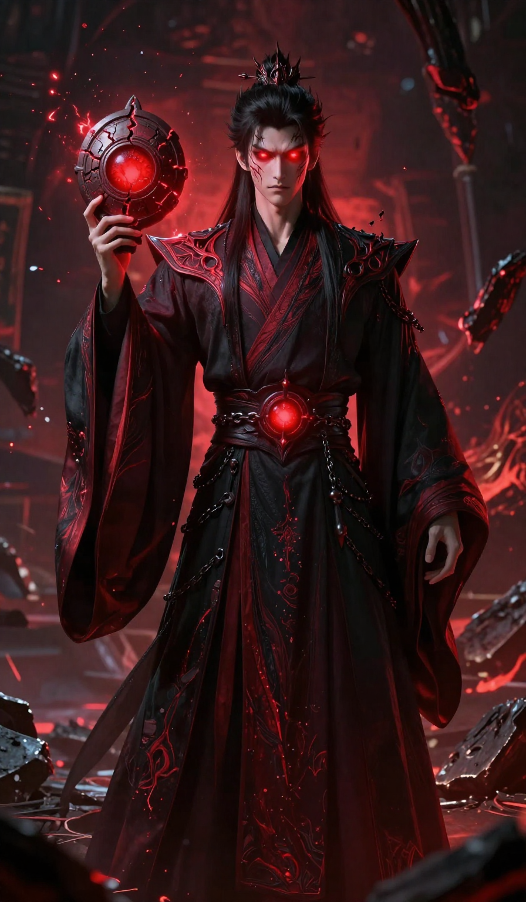

# 만마의 주인, 역천의 신 천마

상태: 완료
등급: 중신격
성향: 회색신
도메인: 의지, 전쟁, 혼돈
포트폴리오: 강자존, 마도, 무공의 극의, 성화, 약육강식, 약자도태, 역천, 인간 초월
생성 일시: 2026년 5월 21일 오전 12:11
최종 편집 일시: 2026년 6월 3일 오후 5:14
성향 정렬값: 2
등급 정렬값: 3
대표: No
청연 만신전: Yes

# 개요

천마는 청연의 무림에서 가장 위험한 신격으로, 신혈이나 하늘의 허락 없이도 인간이 의지와 무공만으로 신격의 경계에 닿을 수 있다는 **역천(逆天)의 상징**으로 여겨진다. 옥황이 질서를 ‘관리’한다면, 천마는 질서를 ‘거꾸로 꺾어’ 돌파한다. 천마 신앙은 단순한 파괴와 광기의 종교가 아니라, 수련과 각성, 금기의 지름길을 통해 약자를 강자로 끌어올리는 유혹이기도 하다. 그래서 천마는 무림의 영웅담과 비극을 동시에 낳는다. 어떤 이에게는 억압된 신분과 혈통, 사문과 관료의 사슬을 끊는 해방이며, 다른 이에게는 공동체를 찢어 놓는 독이다. 천마의 존재가 무림을 넘어 국가의 정치까지 흔드는 이유는, 그 교리가 “권위는 하늘에서 오지 않는다”는 한 문장으로 모든 정통성과 혈통 서열을 동시에 부정하기 때문이다.

# 교단명

- **천마신교**

아직은 통일된 교단이라기보다, 각지의 사파와 마도 계열이 느슨하게 공유하는 상징과 의식의 집합체로 알려져 있다.

# 교리

- **1. 하늘은 길을 주지 않는다. 길은 빼앗는 것이다.**
    - **해설:** 천명과 혈통, 제례의 정통성을 부정하고 스스로 길을 열어야 한다는 핵심 선언이다.
- **2. 무공은 기술이 아니라 존재의 증명이다.**
    - **해설:** 수련의 목적은 승리가 아니라 ‘하늘의 질서와 무관한 자신’의 완성이라고 가르친다.
- **3. 금기는 약자의 족쇄다. 강자는 금기를 먹고 자란다.**
    - **해설:** 금기 경전과 위험한 내공법을 탐한다. 다만 그 대가를 감당할 수 있는가가 시험이 된다.
- **4. 패배는 죄가 아니다. 멈추는 것이 죄다.**
    - **해설:** 도덕보다 전진을 우선하며, 멈춘 자는 ‘스스로를 배신’했다고 규정한다.
- **5. 의지는 피보다 깊다.**
    - **해설:** 혈통·가문·국적보다 개인의 의지와 선택이 더 근원적이라는 사상이 무림의 인재를 끌어모은다.
- **6. 하늘을 거스르면 반드시 값이 따른다. 그 값을 웃으며 삼켜라.**
    - **해설:** 천마 신앙은 대가를 숨기지 않는다. 오히려 대가를 감내하는 태도가 신앙의 자격이라 여긴다.

# 성화(聖火)

천마의 규율은 곧 성화로 불린다. 천마가 보여 준 역천의 길은 무질서한 광기가 아니라, 의지를 태워 스스로를 벼리는 규율이라는 해석이 천마신교 내부에서 굳어졌다. 그래서 교단은 성화를 “천마의 뜻이 남긴 불”로 세우고, 교리의 여섯 문장을 성화의 뼈대로 읽는다.

성화의 최소 금기는 분명하다. **어린 아이와 무공을 배우지 않은 이들을 함부로 해치지 않는다.** 이는 자비의 규범이라기보다, “싸움은 경지로 말해야 한다”는 천마의 질서를 신앙의 내부 법도로 고정하는 장치로 여겨진다. 성화를 어긴 자는 교단 안에서도 천마의 이름을 더럽힌 자로 낙인찍혀, 추방이나 숙청의 대상이 될 수 있다.

# 금기 경전과 ‘지름길’

천마의 계시는 주로 금기 경전, 손상된 비전, 혹은 이름 없는 사제의 구전으로 전해진다. 그 내용은 대체로 “짧은 시간에 경지를 올리는” 기술을 약속하지만, 그 대가로 신체의 균형과 정신의 경계, 인간 관계의 끈을 끊어 낸다. 역천의 힘은 ‘빼앗아 쌓는’ 방식이기에, 하나를 얻을 때마다 하나를 잃는다는 말이 뒤따른다. 그래서 천마를 따르는 자는 강해질수록 고독해지고, 고독해질수록 더 깊은 지름길을 찾는다. 이 악순환이 무림을 마교의 그늘로 밀어 넣는다.

# 천마와 국가 질서

운경은 천마를 “천명을 부정하는 이단”으로 규정하지만, 동시에 천마가 너무 커지면 옥황의 질서가 흔들린다는 사실을 인정한다. 단령은 천마를 군율의 적으로 보며 사냥하려 하지만, 천마의 무공은 막부의 무가에게도 매혹적이다. 해월은 상단과 항만 도시에서 천마의 세력이 암암리에 퍼지는 것을 두려워한다. 천마는 단순한 무림의 종교가 아니라, 청연 전체가 공유하는 약점—권위의 불완전함, 신앙과 국가가 동일시되는 구조—을 정면으로 찌르는 존재다.

# 계시와 가호

천마의 가호는 보호가 아니라 **폭발적인 각성**으로 나타난다. 전투와 위기, 굴욕의 순간에 내공이 비약적으로 솟아오르거나, 몸이 부서질 듯한 통증과 함께 새로운 경지가 열리는 식이다. 그러나 그 가호는 항상 빚을 남긴다. 어느 날 갑자기 기혈의 흐름이 뒤틀리거나, 소중한 사람을 잃는 형태로 대가가 찾아온다는 전승이 많다.

# 신앙의 성향

천마는 문명권 입장에서 악신에 가깝지만, 신앙 내부에서는 “악”이 아니라 “해방”과 “돌파”, 그리고 “역천”으로 해석된다. 신앙의 핵심은 선악이 아니라 대가이며, 대가를 감내하는 자만이 스스로를 신격의 경계로 끌어올릴 수 있다고 믿는다. 그래서 천마 신앙은 언제나 ‘구원의 말’을 경계한다. 그들이 약속하는 것은 구원이 아니라, 구원을 필요로 하지 않는 힘—그리고 그 힘이 남기는 상흔이다.

# 관계

천마는 청연 만신전의 관계 구도에서 가장 큰 균열을 만드는 신격이다. [천명의 주재자, 하늘 질서의 신 옥황](%EC%B2%9C%EB%AA%85%EC%9D%98%20%EC%A3%BC%EC%9E%AC%EC%9E%90,%20%ED%95%98%EB%8A%98%20%EC%A7%88%EC%84%9C%EC%9D%98%20%EC%8B%A0%20%EC%98%A5%ED%99%A9%201b60fa8f268b4e319788909337dfdfdf.md)과 [맹세의 집행자, 법과 형벌의 신 법도천군](%EB%A7%B9%EC%84%B8%EC%9D%98%20%EC%A7%91%ED%96%89%EC%9E%90,%20%EB%B2%95%EA%B3%BC%20%ED%98%95%EB%B2%8C%EC%9D%98%20%EC%8B%A0%20%EB%B2%95%EB%8F%84%EC%B2%9C%EA%B5%B0%20db31984dfc7e41c0944bf663701406c1.md)이 천명·법·절차로 질서를 고정하려 할수록, 천마는 그 질서를 “하늘이 만든 사슬”로 규정하며 정면으로 깨려 한다. 대신 천마는 어둠의 방법론 자체를 사랑해서가 아니라, “드러난 질서 밖에서 길을 여는 기술”이 필요하다는 이유로 [검은 밤의 파수자, 어둠과 비밀의 신 현야신군](%EA%B2%80%EC%9D%80%20%EB%B0%A4%EC%9D%98%20%ED%8C%8C%EC%88%98%EC%9E%90,%20%EC%96%B4%EB%91%A0%EA%B3%BC%20%EB%B9%84%EB%B0%80%EC%9D%98%20%EC%8B%A0%20%ED%98%84%EC%95%BC%EC%8B%A0%EA%B5%B0%203dbc3a3b24c44c0cb0f0716fbbfe6565.md) 및 [피맹세의 추적자, 원한과 복수의 신 암향신군](%ED%94%BC%EB%A7%B9%EC%84%B8%EC%9D%98%20%EC%B6%94%EC%A0%81%EC%9E%90,%20%EC%9B%90%ED%95%9C%EA%B3%BC%20%EB%B3%B5%EC%88%98%EC%9D%98%20%EC%8B%A0%20%EC%95%94%ED%96%A5%EC%8B%A0%EA%B5%B0%2002ac728e29844c2dbe2667ce165be046.md)의 신앙과 우호적으로 엮이기 쉽다. 그러나 그 우호는 언제든 갈라진다. 천마가 초월을 향할 때, 암향의 복수는 특정 원한에 묶여 있기 때문이다.

## 관계 DB 항목

- **옥황 ↔ 천마** / **대립** / **비공개**
**쟁점:** 천명·왕조 정통성 vs 인간 역천(무림)
**세션 징후:** 이단 심문 강화, 무림 문파 숙청·도피, 천마신교 확산
- **법도천군 ↔ 천마** / **대립** / **부분 공개**
**쟁점:** 법·맹약·형벌의 집행 vs ‘힘으로 길을 연다’는 역천
**세션 징후:** 무림의 규율 논쟁, 교단 내부 숙청, 비무 규칙 붕괴 사건
- **염라 ↔ 천마** / **견제** / **비공개**
**쟁점:** 사후 명부·윤회 질서 vs 경지로 면책하려는 유혹
**세션 징후:** 사령술/마공 단죄, ‘죽음조차 돌파’ 루머 확산, 사후 실무자 조사

# 요약

- **분류**: 청연 무림의 역천·무공·의지를 관장하는 중신격
- **교단명**: 천마신교
- **주요 교리**: 길은 하늘이 주지 않으며, 의지는 피보다 깊고 금기는 돌파의 연료다
- **신앙의 역할**: 무림의 사파·마도 결집, 국가 질서에 대한 지속적 위협
- **금기**: (신앙 내부) 멈춤과 후퇴, 사제의 배신, 지름길의 부정
- **대표 전승**: 무명의 하인이 주인의 검을 빼앗아 산문을 깨고 올라가 천마의 경지를 보았으나, 그날부터 자신의 이름을 잊어 ‘하늘의 기록’에서 지워졌다는 이야기
